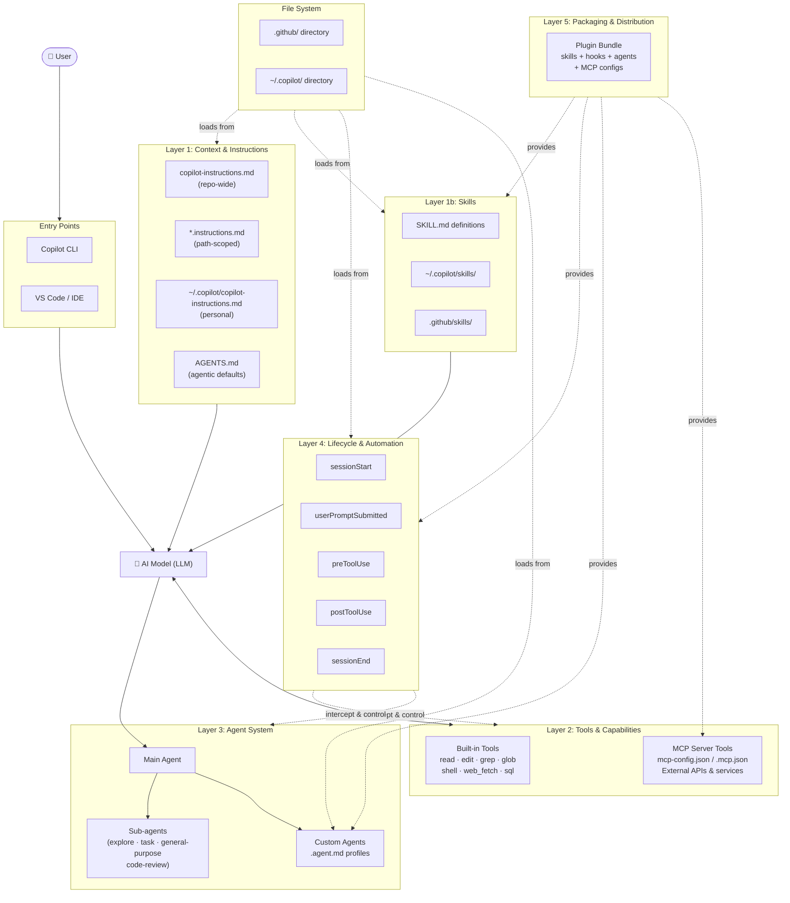

# GitHub Copilot Architecture Overview

This guide provides a comprehensive look at GitHub Copilot's extensibility architecture — the layers, components, and file conventions that let you customize how Copilot reasons, acts, and integrates with external systems. Whether you're writing custom instructions, wiring up MCP servers, or building full plugins, this document maps the entire landscape so you can get the most out of Copilot.

---

## Architecture Diagram



---

## High-Level Summary Table

| Concept | What It Does | When To Use | File Location |
|---|---|---|---|
| **Custom Instructions** | Injects behavioral guidance and rules into every Copilot session | Set coding standards, tone, frameworks, or constraints | `.github/copilot-instructions.md`, `.github/instructions/*.instructions.md`, `~/.copilot/copilot-instructions.md`, `AGENTS.md` |
| **Skills** | Defines reusable, self-contained capabilities Copilot can invoke | Package domain knowledge or multi-step workflows | `.github/skills/<name>/SKILL.md`, `~/.copilot/skills/` |
| **Tools** | Built-in actions Copilot can take (read files, run commands, edit code) | Always available — core interaction with the codebase | Built-in; no file needed |
| **MCP Servers** | Extends Copilot's tool set with external APIs and services via the Model Context Protocol | Connect to databases, APIs, third-party systems | `.mcp.json` (project), `~/.copilot/mcp-config.json` (personal) |
| **Hooks** | Runs scripts at lifecycle events to intercept, validate, or modify behavior | Enforce policies, auto-format, gate dangerous operations | `.github/hooks/*.json` |
| **Sub-agents** | Built-in specialist agents launched by the main agent for parallel work | Offload exploration, testing, code review to focused workers | Invoked via `task` tool; no file needed |
| **Custom Agents** | User-defined agent profiles with specialized instructions and tool access | Create domain experts (e.g., "database agent", "security reviewer") | `.github/agents/*.agent.md`, `~/.copilot/agents/` |
| **Plugins** | Bundles that package skills, hooks, agents, and MCP configs together | Distribute a complete Copilot extension as a reusable unit | Plugin package definition |

---

## Architecture Layers

### Layer 1: Context & Instructions

Copilot's behavior starts with instructions loaded from multiple sources. **Repository instructions** (`.github/copilot-instructions.md`) apply to every session in that repo. **Path-scoped instructions** (`*.instructions.md` with glob headers) activate only when working on matching files. **Personal instructions** (`~/.copilot/copilot-instructions.md`) follow you across all repos. `AGENTS.md` at the repo root provides agentic-mode defaults. All are merged and injected into the system prompt before the LLM sees your request.

### Layer 2: Tools & Capabilities

Tools are the actions Copilot can perform. **Built-in tools** — `view`, `edit`, `grep`, `glob`, `powershell`/`bash`, `web_fetch`, `sql`, and others — ship with Copilot and require no configuration. **MCP servers** extend this set by exposing external APIs (databases, cloud services, custom backends) as callable tools via the Model Context Protocol. MCP configs live in `.mcp.json` (per-project) or `~/.copilot/mcp-config.json` (personal).

### Layer 3: Agent System

The **main agent** orchestrates the session. It can delegate work to **sub-agents** — specialized workers like `explore` (fast research), `task` (run commands), `general-purpose` (complex multi-step), and `code-review` (diff analysis). **Custom agents** (`.agent.md` files) let you define named specialists with their own instructions, tool access, and personality — essentially reusable expert profiles.

### Layer 4: Lifecycle & Automation

**Hooks** fire at defined lifecycle events: `sessionStart`, `userPromptSubmitted`, `preToolUse`, `postToolUse`, and `sessionEnd`. Each hook can run a script that inspects context, modifies behavior, blocks operations, or performs side effects. Use hooks to enforce policies (e.g., block shell commands matching a pattern), auto-format output, or integrate with external approval systems.

### Layer 5: Packaging & Distribution

**Plugins** bundle skills, hooks, agents, and MCP configurations into a single distributable unit. They let teams and the community share complete Copilot extensions — a plugin might include a custom agent for Kubernetes, a skill for Helm chart generation, hooks for security scanning, and an MCP config for the cluster API, all in one package.

---

## File System Map

```
.github/
├── copilot-instructions.md              # Repository-wide behavioral instructions
├── instructions/
│   └── *.instructions.md                # Path-specific instructions (glob-scoped)
├── agents/
│   └── *.agent.md                       # Custom agent profiles
├── skills/
│   └── skill-name/
│       └── SKILL.md                     # Skill definition + metadata
├── hooks/
│   └── *.json                           # Hook configurations (lifecycle scripts)
├── copilot-architecture-class/
│   └── (learning materials like this file)
└── workflows/
    └── copilot-setup-steps.yml          # Cloud agent environment setup

~/.copilot/
├── copilot-instructions.md              # Personal instructions (all repos)
├── config.json                          # CLI configuration & preferences
├── mcp-config.json                      # Personal MCP server definitions
├── skills/                              # Personal skill definitions
└── agents/                              # Personal agent profiles

Project root:
├── .mcp.json                            # Project-level MCP server config
└── AGENTS.md                            # Agentic-mode defaults
```

---

## Quick Reference: How Copilot Processes a Prompt

1. **Load instructions** — Merge custom instructions from `.github/copilot-instructions.md`, matching `*.instructions.md` files, `~/.copilot/copilot-instructions.md`, and `AGENTS.md` into the system context.
2. **Evaluate skills** — Check the prompt against available skill definitions (`SKILL.md` files) to determine if a specialized skill should be activated.
3. **Select tools** — Identify which built-in tools and MCP server tools are relevant to the request.
4. **Fire `userPromptSubmitted` hook** — Run any configured hook scripts that intercept the submitted prompt (can modify or gate the request).
5. **Execute with tools** — The LLM generates tool calls; each fires `preToolUse` (can block or modify) → tool execution → `postToolUse` (can inspect results).
6. **Delegate to sub-agents** — If the task benefits from parallelism or specialization, the main agent launches sub-agents with custom agent profiles providing focused instructions.
7. **Return result** — Final output is assembled and returned to the user. The `sessionEnd` hook fires when the session concludes.
